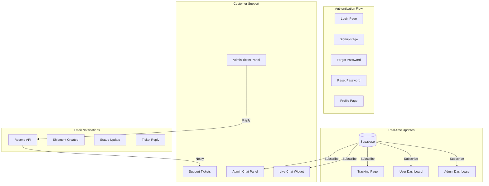
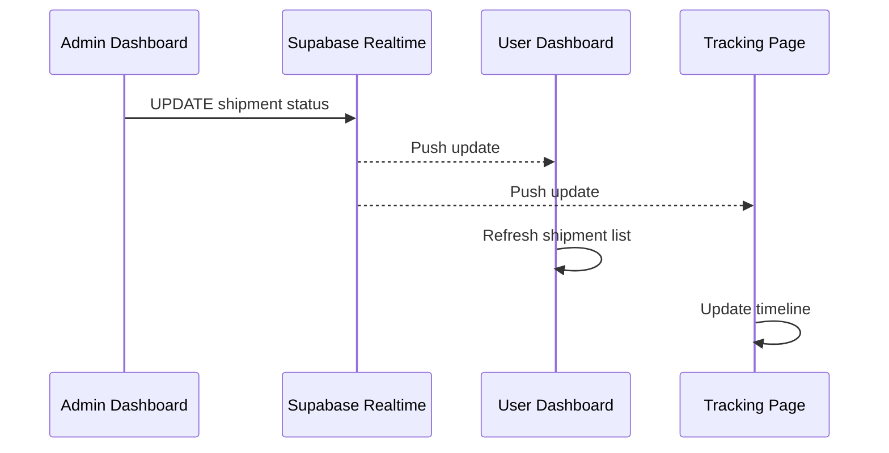
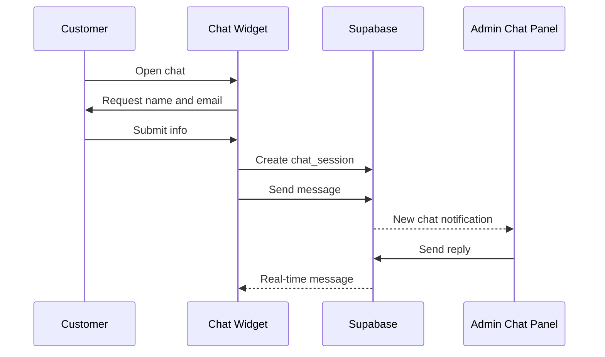
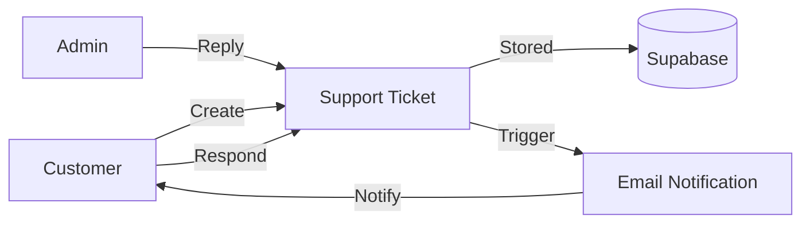

# PerfectExpress Feature Implementation Plan

## Architecture Overview




---

## Phase 1: Fix Middleware Deprecation Warning

The Next.js 16 warning about middleware can be addressed by updating the config matcher. The middleware itself is functional.

**File:** `[src/middleware.ts](src/middleware.ts)`

- Update the export config to use the recommended pattern
- Add explicit runtime declaration
- No logic changes needed - just config updates

---

## Phase 2: Enable Email Notifications

Email system is already implemented in `[src/lib/email.ts](src/lib/email.ts)` with 5 email functions. Just needs API key configuration and minor enhancements.

**Tasks:**

1. Add `RESEND_API_KEY` to `.env.local`
2. Add receiver notification on shipment creation
3. Add email on payment confirmation
4. Verify all email triggers are working

**Files to modify:**

- `.env.local` - Add Resend API key
- `[src/app/actions/shipment.ts](src/app/actions/shipment.ts)` - Add receiver email on creation
- `[src/app/admin/actions.ts](src/app/admin/actions.ts)` - Add email to payment confirmation

---

## Phase 3: Improve Tracking Map

Current map uses hardcoded coordinates. We'll prepare it for geocoding while keeping it functional without Google API key.

**File:** `[src/components/TrackingMap.tsx](src/components/TrackingMap.tsx)`

**Approach:**

1. Update component to accept origin/destination addresses
2. Add geocoding utility (when API key available)
3. Show placeholder map with location text when no API key
4. Display route between origin and current location when possible

**Database update:** Add optional `coordinates` JSONB field to shipments for caching geocoded locations

---

## Phase 4: Add Real-time Updates

Implement Supabase Realtime subscriptions across all dashboards.




**New file:** `src/hooks/useRealtimeShipments.ts` - Reusable hook for shipment subscriptions

**Files to modify:**

- `[src/app/admin/page.tsx](src/app/admin/page.tsx)` - Subscribe to all shipments
- `[src/app/dashboard/DashboardClient.tsx](src/app/dashboard/DashboardClient.tsx)` - Subscribe to user's shipments
- `[src/app/track/[tracking_number]/page.tsx](src/app/track/[tracking_number]/page.tsx)` - Subscribe to specific shipment

**Features:**

- Auto-refresh when shipments are created/updated
- Toast notifications for status changes
- Visual indicator for live updates

---

## Phase 5: User Profile Page

Create a new profile page where users can manage their account.

**New files:**

- `src/app/profile/page.tsx` - Profile page (server component)
- `src/app/profile/ProfileClient.tsx` - Client component with edit form

**Features:**

- View current profile info
- Update full name
- Update email (with re-verification)
- Change password (with current password confirmation)
- View shipment statistics

**Navbar update:** Add "Profile" link to user dropdown menu in `[src/components/layout/Navbar.tsx](src/components/layout/Navbar.tsx)`

**New server actions in `[src/app/actions/auth.ts](src/app/actions/auth.ts)`:**

- `updateProfile()` - Update name
- `updateEmail()` - Update email
- `changePassword()` - Change password

---

## Phase 6: Password Reset Flow

Implement complete forgot/reset password flow using Supabase Auth.

**New files:**

- `src/app/auth/forgot-password/page.tsx` - Request password reset
- `src/app/auth/reset-password/page.tsx` - Set new password (handles token from email)

**Flow:**

1. User clicks "Forgot Password?" on login page
2. Enters email on forgot-password page
3. Supabase sends reset link via email
4. User clicks link, lands on reset-password page with token
5. User sets new password

**Files to modify:**

- `[src/app/auth/login/page.tsx](src/app/auth/login/page.tsx)` - Add "Forgot Password?" link
- `[src/app/actions/auth.ts](src/app/actions/auth.ts)` - Add `requestPasswordReset()` and `updatePassword()` actions

---

## Phase 7: Live Chat System

Real-time chat between customers and admin support staff. Customers provide name/email to start a conversation.




**Database Schema (new tables):**

```sql
-- Chat Sessions
create table chat_sessions (
  id uuid primary key default uuid_generate_v4(),
  visitor_name text not null,
  visitor_email text not null,
  user_id uuid references auth.users(id),
  status text default 'active' check (status in ('active', 'closed')),
  created_at timestamptz default now(),
  updated_at timestamptz default now()
);

-- Chat Messages
create table chat_messages (
  id uuid primary key default uuid_generate_v4(),
  session_id uuid references chat_sessions(id) on delete cascade,
  sender_type text not null check (sender_type in ('visitor', 'admin')),
  sender_name text,
  message text not null,
  created_at timestamptz default now()
);
```

**New files:**

- `src/components/LiveChat.tsx` - Floating chat widget (appears on all pages)
- `src/app/admin/chat/page.tsx` - Admin chat management page
- `src/app/actions/chat.ts` - Server actions for chat operations
- `src/hooks/useRealtimeChat.ts` - Real-time chat subscription hook

**Features:**

- Floating chat bubble on customer-facing pages
- Name/email collection form before starting chat
- Real-time message delivery using Supabase Realtime
- Admin panel shows all active chats with unread indicators
- Chat history preserved for logged-in users
- Close/reopen chat sessions

---

## Phase 8: Support Ticket System

Ticket-based support for non-urgent issues with email notifications on replies.




**Database Schema (new tables):**

```sql
-- Support Tickets
create table support_tickets (
  id uuid primary key default uuid_generate_v4(),
  ticket_number text unique,
  user_id uuid references auth.users(id),
  name text not null,
  email text not null,
  subject text not null,
  status text default 'open' check (status in ('open', 'in_progress', 'resolved', 'closed')),
  priority text default 'normal' check (priority in ('low', 'normal', 'high', 'urgent')),
  created_at timestamptz default now(),
  updated_at timestamptz default now()
);

-- Ticket Replies
create table ticket_replies (
  id uuid primary key default uuid_generate_v4(),
  ticket_id uuid references support_tickets(id) on delete cascade,
  sender_type text not null check (sender_type in ('customer', 'admin')),
  sender_name text,
  message text not null,
  created_at timestamptz default now()
);
```

**New files:**

- `src/app/support/page.tsx` - Support center page (create ticket, view tickets)
- `src/app/support/[ticket_id]/page.tsx` - Individual ticket view with reply thread
- `src/app/admin/tickets/page.tsx` - Admin ticket management
- `src/app/actions/tickets.ts` - Server actions for ticket operations
- `src/lib/email.ts` - Add `sendTicketReplyNotification()` function

**Features:**

- Create new support tickets (name, email, subject, description)
- Auto-generated ticket numbers (TKT-XXXXXXXX)
- View ticket history and replies in-app
- Reply to tickets from both customer and admin side
- Email notification sent to customer on every admin reply
- Email notification sent to admin on customer reply
- Ticket status management (open, in progress, resolved, closed)
- Priority levels for admin triage

**Email notifications:**

- Customer receives email when admin replies
- Admin receives email when customer replies
- Email includes link to view ticket in-app

---

## Files Summary


| Action | File Path                                  | Phase |
| ------ | ------------------------------------------ | ----- |
| Modify | `src/middleware.ts`                        | 1     |
| Modify | `.env.local`                               | 2     |
| Modify | `src/app/actions/shipment.ts`              | 2     |
| Modify | `src/app/admin/actions.ts`                 | 2     |
| Modify | `src/components/TrackingMap.tsx`           | 3     |
| Create | `src/hooks/useRealtimeShipments.ts`        | 4     |
| Modify | `src/app/admin/page.tsx`                   | 4     |
| Modify | `src/app/dashboard/DashboardClient.tsx`    | 4     |
| Modify | `src/app/track/[tracking_number]/page.tsx` | 4     |
| Create | `src/app/profile/page.tsx`                 | 5     |
| Create | `src/app/profile/ProfileClient.tsx`        | 5     |
| Modify | `src/components/layout/Navbar.tsx`         | 5     |
| Modify | `src/app/actions/auth.ts`                  | 5, 6  |
| Create | `src/app/auth/forgot-password/page.tsx`    | 6     |
| Create | `src/app/auth/reset-password/page.tsx`     | 6     |
| Modify | `src/app/auth/login/page.tsx`              | 6     |
| Create | `supabase/chat_schema.sql`                 | 7     |
| Create | `src/components/LiveChat.tsx`              | 7     |
| Create | `src/app/admin/chat/page.tsx`              | 7     |
| Create | `src/app/actions/chat.ts`                  | 7     |
| Create | `src/hooks/useRealtimeChat.ts`             | 7     |
| Create | `supabase/tickets_schema.sql`              | 8     |
| Create | `src/app/support/page.tsx`                 | 8     |
| Create | `src/app/support/[ticket_id]/page.tsx`     | 8     |
| Create | `src/app/admin/tickets/page.tsx`           | 8     |
| Create | `src/app/actions/tickets.ts`               | 8     |
| Modify | `src/lib/email.ts`                         | 8     |
| Modify | `src/components/layout/Footer.tsx`         | 7, 8  |


---

## Database Migrations

Two new SQL files will be created for the chat and ticket tables:

- `supabase/chat_schema.sql` - Chat sessions and messages tables with RLS
- `supabase/tickets_schema.sql` - Support tickets and replies tables with RLS

---

## Environment Variables

```bash
# Already configured
NEXT_PUBLIC_SUPABASE_URL=https://jcnoftoyozkvndkqldfx.supabase.co
NEXT_PUBLIC_SUPABASE_ANON_KEY=...

# To be added
RESEND_API_KEY=re_GdJ6aBC4_LJbivyGCd6wmAEstYptmaepN
NEXT_PUBLIC_GOOGLE_MAPS_API_KEY=xxxxx  # Optional, for map geocoding
```

