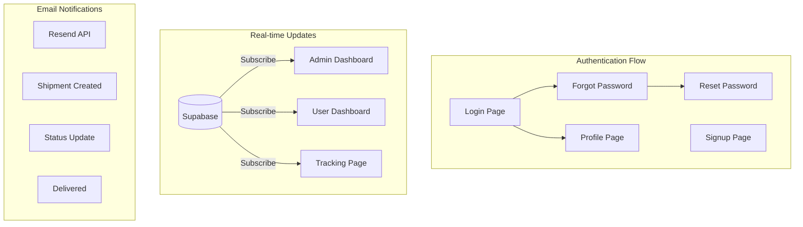
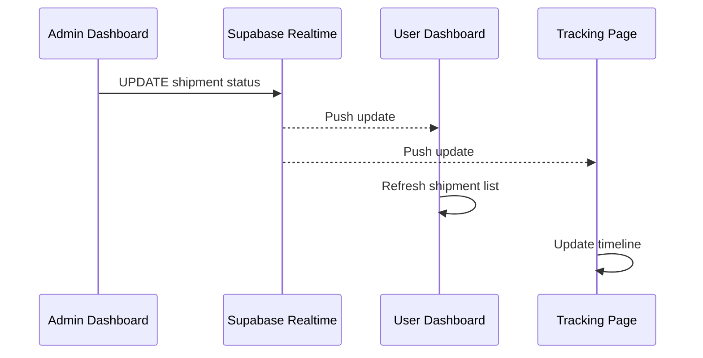

# PerfectExpress Feature Implementation Plan

## Architecture Overview




---

## Phase 1: Fix Middleware Deprecation Warning

The Next.js 16 warning about middleware can be addressed by updating the config matcher. The middleware itself is functional.

**File:** `[src/middleware.ts](src/middleware.ts)`

- Update the export config to use the recommended pattern
- Add explicit runtime declaration
- No logic changes needed - just config updates

---

## Phase 2: Enable Email Notifications

Email system is already implemented in `[src/lib/email.ts](src/lib/email.ts)` with 5 email functions. Just needs API key configuration and minor enhancements.

**Tasks:**

1. Add `RESEND_API_KEY` to `.env.local`
2. Add receiver notification on shipment creation
3. Add email on payment confirmation
4. Verify all email triggers are working

**Files to modify:**

- `.env.local` - Add Resend API key
- `[src/app/actions/shipment.ts](src/app/actions/shipment.ts)` - Add receiver email on creation
- `[src/app/admin/actions.ts](src/app/admin/actions.ts)` - Add email to payment confirmation

---

## Phase 3: Improve Tracking Map

Current map uses hardcoded coordinates. We'll prepare it for geocoding while keeping it functional without Google API key.

**File:** `[src/components/TrackingMap.tsx](src/components/TrackingMap.tsx)`

**Approach:**

1. Update component to accept origin/destination addresses
2. Add geocoding utility (when API key available)
3. Show placeholder map with location text when no API key
4. Display route between origin and current location when possible

**Database update:** Add optional `coordinates` JSONB field to shipments for caching geocoded locations

---

## Phase 4: Add Real-time Updates

Implement Supabase Realtime subscriptions across all dashboards.




**New file:** `src/hooks/useRealtimeShipments.ts` - Reusable hook for shipment subscriptions

**Files to modify:**

- `[src/app/admin/page.tsx](src/app/admin/page.tsx)` - Subscribe to all shipments
- `[src/app/dashboard/DashboardClient.tsx](src/app/dashboard/DashboardClient.tsx)` - Subscribe to user's shipments
- `[src/app/track/[tracking_number]/page.tsx](src/app/track/[tracking_number]/page.tsx)` - Subscribe to specific shipment

**Features:**

- Auto-refresh when shipments are created/updated
- Toast notifications for status changes
- Visual indicator for live updates

---

## Phase 5: User Profile Page

Create a new profile page where users can manage their account.

**New files:**

- `src/app/profile/page.tsx` - Profile page (server component)
- `src/app/profile/ProfileClient.tsx` - Client component with edit form

**Features:**

- View current profile info
- Update full name
- Update email (with re-verification)
- Change password (with current password confirmation)
- View shipment statistics

**Navbar update:** Add "Profile" link to user dropdown menu in `[src/components/layout/Navbar.tsx](src/components/layout/Navbar.tsx)`

**New server actions in `[src/app/actions/auth.ts](src/app/actions/auth.ts)`:**

- `updateProfile()` - Update name
- `updateEmail()` - Update email
- `changePassword()` - Change password

---

## Phase 6: Password Reset Flow

Implement complete forgot/reset password flow using Supabase Auth.

**New files:**

- `src/app/auth/forgot-password/page.tsx` - Request password reset
- `src/app/auth/reset-password/page.tsx` - Set new password (handles token from email)

**Flow:**

1. User clicks "Forgot Password?" on login page
2. Enters email on forgot-password page
3. Supabase sends reset link via email
4. User clicks link, lands on reset-password page with token
5. User sets new password

**Files to modify:**

- `[src/app/auth/login/page.tsx](src/app/auth/login/page.tsx)` - Add "Forgot Password?" link
- `[src/app/actions/auth.ts](src/app/actions/auth.ts)` - Add `requestPasswordReset()` and `updatePassword()` actions

---

## Files Summary


| Action | File Path                                  |
| ------ | ------------------------------------------ |
| Modify | `src/middleware.ts`                        |
| Modify | `.env.local`                               |
| Modify | `src/app/actions/shipment.ts`              |
| Modify | `src/app/admin/actions.ts`                 |
| Modify | `src/components/TrackingMap.tsx`           |
| Create | `src/hooks/useRealtimeShipments.ts`        |
| Modify | `src/app/admin/page.tsx`                   |
| Modify | `src/app/dashboard/DashboardClient.tsx`    |
| Modify | `src/app/track/[tracking_number]/page.tsx` |
| Create | `src/app/profile/page.tsx`                 |
| Create | `src/app/profile/ProfileClient.tsx`        |
| Modify | `src/components/layout/Navbar.tsx`         |
| Modify | `src/app/actions/auth.ts`                  |
| Create | `src/app/auth/forgot-password/page.tsx`    |
| Create | `src/app/auth/reset-password/page.tsx`     |
| Modify | `src/app/auth/login/page.tsx`              |


---

## Environment Variables Needed

```bash
# Already have
NEXT_PUBLIC_SUPABASE_URL=...
NEXT_PUBLIC_SUPABASE_ANON_KEY=...

# Add these
RESEND_API_KEY=re_xxxxx  # Your Resend API key
NEXT_PUBLIC_GOOGLE_MAPS_API_KEY=xxxxx  # Optional, for map geocoding
```

