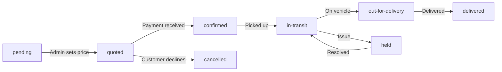

# Shipment Status Flow Improvement

## Current Problem

The current implementation has conflicting status displays:

- `status` field shows: pending, accepted, in-transit, out-for-delivery, delivered, held
- `payment_status` field shows: unpaid, paid
- UI hack: Shows "AWAITING PAYMENT" when `status === 'pending' && price` exists

This creates contradictions like "AWAITING PAYMENT" (displayed) with "paid" (payment_status).

## Industry-Standard Courier Flow




## Proposed Status Values


| Status             | Meaning                                        | Payment State   |
| ------------------ | ---------------------------------------------- | --------------- |
| `pending`          | New shipment, needs admin review/pricing       | unpaid          |
| `quoted`           | Price set, awaiting customer payment           | unpaid          |
| `confirmed`        | Payment received, ready for pickup             | paid            |
| `in-transit`       | Package picked up and moving                   | paid            |
| `out-for-delivery` | On delivery vehicle                            | paid            |
| `delivered`        | Successfully delivered                         | paid            |
| `held`             | Package on hold (customs, address issue, etc.) | paid            |
| `cancelled`        | Order cancelled                                | unpaid/refunded |


## Changes Required

### 1. Update Database Schema

File: [supabase/schema.sql](supabase/schema.sql)

Update the status constraint to include new statuses:

```sql
status text check (status in ('pending', 'quoted', 'confirmed', 'in-transit', 'out-for-delivery', 'delivered', 'held', 'cancelled')) default 'pending'
```

Run migration via Supabase MCP to alter the existing table.

### 2. Update Admin Actions

File: [src/app/admin/actions.ts](src/app/admin/actions.ts)

- `handleApproveShipment`: Set status to `quoted` (not pending)
- `handleConfirmPayment`: Set status to `confirmed` (not accepted), payment_status to `paid`
- `handleDispatch`: Set status to `in-transit`

### 3. Update Admin Page Display

File: [src/app/admin/page.tsx](src/app/admin/page.tsx)

- Remove the "AWAITING PAYMENT" display hack
- Update `STATUS_OPTIONS` array with new statuses
- Update `getStatusColor()` function with colors for new statuses
- Update `renderSmartAction()` logic for the new flow
- Show actual status values (no transformation needed)

### 4. Update Database Types

File: [src/types/database.types.ts](src/types/database.types.ts)

Update the status type to reflect new valid values.

## Smart Action Flow (Admin Dashboard)


| Current Status       | Smart Action Button |
| -------------------- | ------------------- |
| `pending` (no price) | "Review & Quote"    |
| `quoted`             | "Confirm Payment"   |
| `confirmed`          | "Dispatch"          |
| `in-transit`         | "Update Status"     |
| `out-for-delivery`   | "Mark Delivered"    |
| `delivered`          | (none - completed)  |
| `held`               | "Release / Update"  |


## Summary

This change:

1. Removes confusing display logic ("AWAITING PAYMENT" hack)
2. Makes status progression clear and linear
3. Payment status becomes secondary info (not mixed with shipment status)
4. Admin always knows exactly what action to take next

